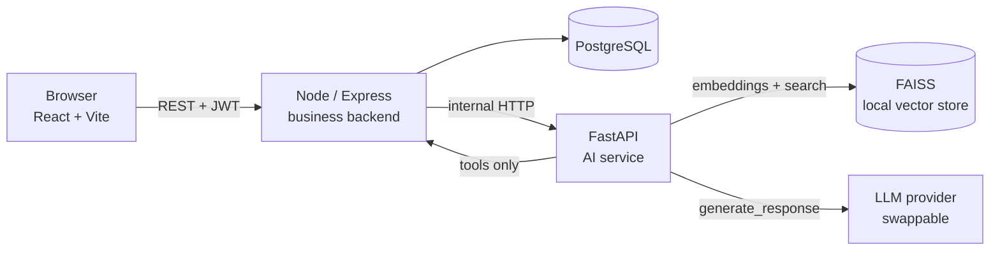
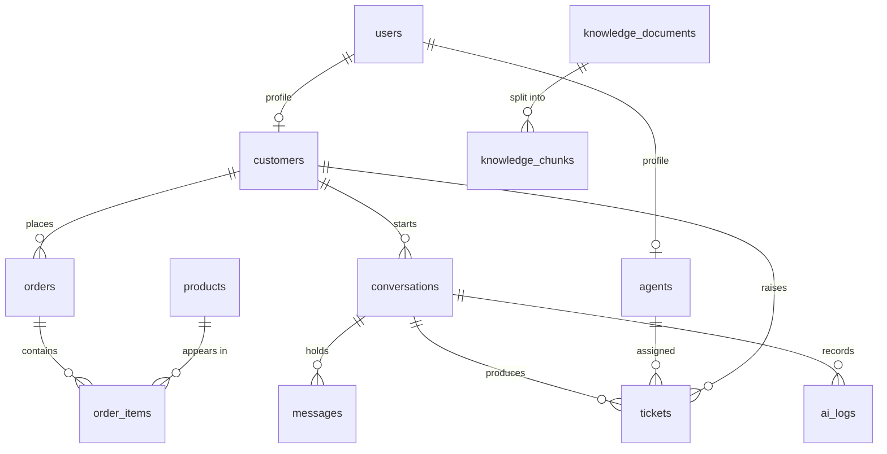

# AI Customer Support & Helpdesk Platform

A customer-support SaaS where an AI agent answers questions from your own policy
documents, calls real business tools for order and ticket data, and hands the
conversation to a human when it should not answer alone.

Runs entirely on a low-end Windows laptop. No GPU, no paid API required.

**Status: Phase 8 complete.** The admin dashboard and AI analytics page are
now real, built entirely on data that's been quietly logging since Phase 2 —
intents, tool usage, and resolution rates were already sitting in `ai_logs`;
this phase is what finally surfaces them. Sentiment is the one genuinely new
signal, added this phase. Hardening and Docker land in the remaining
phases — see [Roadmap](#roadmap).

---

## Architecture



Three deliberate boundaries:

**Business logic never lives in the AI service.** Express owns users, orders,
tickets and every SQL query. FastAPI owns retrieval, prompting and analysis.

**The model never touches the database.** When the AI needs order data it calls a tool,
the tool calls an Express endpoint, and Express queries the database. The blast
radius of a bad generation is a failed HTTP call, not a `DELETE`.

**One LLM seam.** Everything calls `generate_response()` on an `LLMProvider`.
Swapping providers is a `.env` change, not a refactor.

## Tech stack

| Layer | Choice | Why |
|---|---|---|
| Frontend | React 18, Vite, Tailwind, React Router, Axios | Fast dev server, no heavy UI kit |
| Backend | Node 18+, Express, Sequelize, PostgreSQL 16 | Familiar, boring, well-documented |
| Auth | JWT + bcrypt | Stateless, no session store to run |
| AI service | Python 3.11, FastAPI, Pydantic v2 | Type-checked contracts, free Swagger |
| Embeddings | `all-MiniLM-L6-v2`, local | ~90 MB, CPU-only, no API bill |
| Vector store | FAISS (local files) | No extra server; Qdrant swaps in later |

---

## Repository layout

```
ai-helpdesk/
├── backend/              Express: auth, users, tickets, orders, conversations
│   ├── src/
│   │   ├── config/       env loading, Sequelize instance, shared enums
│   │   ├── models/       12 Sequelize models + associations
│   │   ├── middleware/   auth, validation, rate limits, error handler
│   │   ├── services/     business logic (controllers stay thin)
│   │   ├── controllers/  request → service → response
│   │   ├── routes/       route definitions + zod schemas
│   │   ├── utils/        ApiError, response envelope, JWT, logger
│   │   └── seed/         sync.js, seed.js
│   └── tests/            supertest + jest
├── ai-service/           FastAPI: RAG, routing, tools, analysis
│   ├── app/
│   │   ├── api/          chat.py, health.py
│   │   ├── llm/          base.py, provider.py, echo_provider.py
│   │   ├── rag/          Phase 4–5
│   │   ├── agents/       Phase 6–7
│   │   ├── tools/        Phase 6
│   │   └── core/         config, logging, errors
│   ├── data/             documents/, vector_store/
│   └── main.py
├── frontend/             React app
│   └── src/  api/ components/ context/ layouts/ pages/ routes/ styles/
├── knowledge-base/       Seed documents the AI will be grounded in
└── docs/
```

---

## Setup

### Prerequisites

- Node.js 18 or newer
- Python 3.11
- PostgreSQL 16 running locally

### 1. PostgreSQL

Open **SQL Shell (psql)** from the Start menu (installed with PostgreSQL), press
Enter through the host/port/database/username prompts to accept the defaults,
then enter the password you set for the `postgres` user during install. Run:

```sql
CREATE DATABASE helpdesk;
CREATE DATABASE helpdesk_test;

CREATE USER helpdesk_user WITH PASSWORD 'a_password_you_choose';
GRANT ALL PRIVILEGES ON DATABASE helpdesk TO helpdesk_user;
GRANT ALL PRIVILEGES ON DATABASE helpdesk_test TO helpdesk_user;

-- PostgreSQL 15+ also needs explicit schema rights for a non-owner role:
\c helpdesk
GRANT ALL ON SCHEMA public TO helpdesk_user;
\c helpdesk_test
GRANT ALL ON SCHEMA public TO helpdesk_user;
```

### 2. Backend

```bat
cd backend
copy .env.example .env
npm install
```

Edit `.env`: set `DB_PASSWORD` and generate a real `JWT_SECRET` and
`INTERNAL_API_KEY` (two different values — don't reuse one for both):

```bat
node -e "console.log(require('crypto').randomBytes(48).toString('hex'))"
node -e "console.log(require('crypto').randomBytes(32).toString('hex'))"
```

`INTERNAL_API_KEY` is new since Phase 6 — it's how the AI service authenticates
to the backend's tool-facing endpoints, since it has no user login of its own.
Copy the same value into `ai-service/.env`'s `INTERNAL_API_KEY` in the next
step; the two must match exactly or every tool call will 401.

Create the tables and load demo data:

```bat
npm run db:sync
npm run db:seed
npm run dev
```

### 3. AI service

```bat
cd ai-service
copy .env.example .env
python -m venv venv
venv\Scripts\activate
pip install -r requirements.txt
uvicorn main:app --reload --port 5001
```

Set `INTERNAL_API_KEY` in this `.env` to the exact same value you generated
for the backend above.

`requirements.txt` includes `sentence-transformers` and `faiss-cpu` for
retrieval. They pull a CPU build of torch (~200 MB). If that's slow on your
connection, comment those three lines out for now — nothing in Phase 1
imports them, but Phase 4 onward needs them, so uncomment before uploading a
document.

### 4. Frontend

```bat
cd frontend
copy .env.example .env
npm install
npm run dev
```

Three terminals, three ports: frontend 5173, backend 5000, AI service 5001.

---

## Demo accounts

Created by `npm run db:seed`. Local development only.

| Role | Email | Password |
|---|---|---|
| Admin | admin@helpdesk.local | Password123 |
| Agent | priya@helpdesk.local | Password123 |
| Customer | amara@example.com | Password123 |

---

## Verifying Phase 1 + 2 + 3 + 4 + 5 + 6 + 7 + 8

| Check | Expected |
|---|---|
| `curl http://localhost:5000/api/health` | `{"success":true,...,"database":"up"}` |
| `curl http://localhost:5001/health` | `llm_provider: "echo"`, `knowledge_base_chunks: 0` on a fresh setup |
| http://localhost:5001/docs | Swagger UI with `/chat`, `/health`, and `/ingest` |
| Sign in as the customer | Lands on `/chat` |
| Type a message with no documents uploaded yet | A reply appears — the honest `[echo provider]` placeholder, since `LLM_PROVIDER=echo` by default. `sources` is empty. |
| Visit **Past chats** | The thread you just started is listed, with its status |
| From the thread, click **Ask for a human** | Status changes to "Waiting agent"; a matching ticket appears under **My tickets** |
| Sign in as the agent, open **Live chats → Waiting** | The same thread appears; click **Take over** |
| Reply as the agent | Message appears in the thread; sign back in as the customer to see it |
| As the customer, raise a ticket from **My tickets** | It appears immediately, status OPEN |
| As the agent, **Tickets → Queue**, claim it, add an internal note | Note shows on the agent/admin view, never on the customer's |
| As the agent, search **Customers** | Recent orders, tickets and conversations for that person appear |
| Sign in as the admin | Lands on `/admin/dashboard`; **People** lists 14 accounts |
| Admin → **Products**: create, edit, retire a product | Retired products drop out of the default list; still visible with "Show retired" checked |
| Admin → **Orders**: place a simulated order, update its tracking | Order total is computed from the items; tracking fields save independently of status |
| Admin → **Tickets**: reassign a ticket to a different agent | Assignment updates immediately |
| Admin → **Knowledge base**: upload one of the `knowledge-base/*.txt` files | Status moves to READY within a few seconds; chunk count is non-zero; clicking the document shows the actual chunk text |
| `curl http://localhost:5001/health` again | `knowledge_base_chunks` now matches the uploaded document's chunk count |
| Click **Re-index** on that document | Status returns to READY; chunk count unchanged (same source text) |
| As the customer, ask a question that matches the uploaded document (e.g. "what's your return policy?" after uploading `return_policy.txt`) | The echo provider's reply names the source document; sources appear under the message in the chat UI |
| Ask something unrelated (e.g. "what's the weather like") | `used_rag: false`; no sources cited; the AI doesn't pretend the knowledge base covers it |
| Click **Delete** on the uploaded document | Document disappears from the list; `knowledge_base_chunks` drops accordingly; asking the same question again no longer cites it |
| Stop the AI service, then upload a document | Document reaches status FAILED with a readable error, not a crash |
| (Optional) Set `LLM_PROVIDER=openai_compatible` with a free Groq key, restart the AI service, ask a policy question | A real, fluent answer grounded in the uploaded document, not the `[echo provider]` placeholder |
| As the customer, ask "Where is order 5012?" (using a real order number from `npm run db:seed`) | Echo names `get_order_status` and shows the real order's status, tracking number, and total — actual live data, not a document |
| Ask "where is my order?" with no number | Since you have real seeded orders, the AI lists your recent ones instead of just asking you to repeat yourself |
| Ask about an order number that isn't yours | A clean "not found," not another customer's data |
| Ask "I want to talk to a human" mid-chat (not the button) | Conversation moves to the human queue automatically — check **Live chats → Waiting** as an agent; a ticket appears too |
| Ask "can you open a ticket, my item arrived damaged" | Echo names `create_support_ticket` with a real ticket id; check **My tickets** as the customer — it's really there |
| Ask about a product by name (e.g. "tell me about the Aria headphones") | Echo names `get_product_information` with real catalog data (price, stock, warranty) |
| Stop the backend, then ask an order question | The AI service's own health stays up, but the tool call fails cleanly — the reply apologises and offers a human, it doesn't crash or invent an answer; check **Live chats** as an agent afterward — a HIGH priority ticket appeared automatically |
| Ask a specific policy question the knowledge base genuinely doesn't cover (e.g. "do you ship to the moon?") | Conversation moves to the human queue on its own — no button click. Check the ticket: MEDIUM priority |
| Say "I was charged twice for order 5012" | Conversation escalates immediately, even though the AI still answers with the order's real status. Check the ticket: URGENT priority, category "billing" |
| Say something clearly frustrated (e.g. "this is ridiculous, still not fixed") while also asking a real question | Escalates with HIGH priority, and the AI's reply still answers the underlying question rather than just apologising |
| Sign in as the admin, go to **Overview** | Real numbers, not placeholders — customer/conversation counts match what's in the database, and the 14-day line chart has at least one point after any chat activity |
| Go to **AI analytics** | Intent bar chart, sentiment split, tool usage, and handoff reasons all reflect conversations you actually had, not sample data |
| Say "thanks, that was really helpful!" in a chat, then check **AI analytics → Sentiment** | POSITIVE count goes up by one |
| Trigger any Phase 7 escalation, then check **AI analytics → Why conversations escalated** | The matching reason's count goes up by one |
| Open the escalated conversation as an agent | The SYSTEM message explains *why* it escalated, not just that it did — different wording per reason |
| Say "hi" or "thanks" with no knowledge base uploaded | Does **not** escalate — ordinary conversation lacking a document match is normal, not a failure |
| Customer visits `/admin/users` | Redirected to `/chat` |
| `cd backend && npm test` | 51 passing tests |
| `cd ai-service && pytest` | 58 passing tests |

---

## API (Phase 1)

All responses use one envelope: `{ success, message, data, meta? }` on success,
`{ success, message, details? }` on failure.

| Method | Endpoint | Auth | Purpose |
|---|---|---|---|
| GET | `/api/health` | — | Service and database status |
| POST | `/api/auth/register` | — | Create a customer account, returns a token |
| POST | `/api/auth/login` | — | Sign in, returns a token |
| POST | `/api/auth/logout` | any | Client drops the token |
| GET | `/api/auth/me` | any | Current user and role profile |
| PATCH | `/api/auth/password` | any | Change own password |
| GET | `/api/users` | admin | List users (`page`, `limit`, `role`, `search`) |
| POST | `/api/users` | admin | Create an agent, admin or customer |
| GET | `/api/users/:id` | admin | One user with profile |
| PATCH | `/api/users/:id` | admin | Update name or active flag |
| DELETE | `/api/users/:id` | admin | Deactivate (never a hard delete) |
| GET | `/api/conversations` | any | Own threads (customer) or the staff queue (agent/admin) |
| POST | `/api/conversations` | customer | Start a thread with its first message |
| GET | `/api/conversations/:id` | any | Full thread with messages (customer: own only) |
| POST | `/api/conversations/:id/messages` | any | Send a message (agent must have taken it over first) |
| POST | `/api/conversations/:id/handoff` | customer | Move the thread to the human queue |
| POST | `/api/conversations/:id/take-over` | agent, admin | Claim a queued conversation |
| PATCH | `/api/conversations/:id/status` | agent, admin | Change status (e.g. resolve, close) |
| GET | `/api/tickets` | any | Own tickets (customer) or the staff queue (agent/admin) |
| POST | `/api/tickets` | customer | Raise a ticket |
| GET | `/api/tickets/:id` | any | Ticket detail (internal notes never reach a customer) |
| PATCH | `/api/tickets/:id/status` | agent, admin | Change status |
| PATCH | `/api/tickets/:id/priority` | agent, admin | Change priority |
| PATCH | `/api/tickets/:id/assign` | agent, admin | Assign to an agent, or `null` to unassign |
| POST | `/api/tickets/:id/notes` | agent, admin | Add a staff-only internal note |
| GET | `/api/products` | any | Browse the catalog |
| GET/POST/PATCH/DELETE | `/api/products[/:id]` | admin (mutations) | Manage the catalog; delete retires rather than deletes |
| POST | `/api/products/:id/reactivate` | admin | Bring a retired product back |
| GET | `/api/orders` | any | Own orders (customer) or all orders, searchable (staff) |
| GET | `/api/orders/by-number/:orderNumber` | any | Look up by order number (matches how people refer to orders) |
| POST | `/api/orders` | admin | Simulate placing an order (no real checkout in this project) |
| PATCH | `/api/orders/:id` | admin | Update status, tracking, carrier, estimated delivery |
| GET | `/api/customers` | agent, admin | Search the customer directory |
| GET | `/api/customers/:id` | agent, admin | A customer's profile plus recent orders, tickets, conversations |
| GET | `/api/knowledge` | admin | List knowledge base documents |
| POST | `/api/knowledge` | admin | Upload a `.txt` document; ingests it synchronously |
| GET | `/api/knowledge/:id` | admin | Document detail with its stored chunks |
| POST | `/api/knowledge/:id/reindex` | admin | Clear and re-run ingestion for a document |
| DELETE | `/api/knowledge/:id` | admin | Remove a document, its chunks, and its vectors |

Internal, service-to-service only — never called from the browser, and not
protected by a user JWT. Authenticated instead with the `X-Internal-Api-Key`
header, checked against `INTERNAL_API_KEY` (same value in both
`backend/.env` and `ai-service/.env`). This is the entire boundary that lets
the AI service look up real data without ever touching Postgres directly.

| Method | Endpoint | Used by tool |
|---|---|---|
| GET | `/api/internal/orders/by-number/:orderNumber?customerId=` | `get_order_status`, `get_refund_status` |
| GET | `/api/internal/orders?customerId=&limit=` | `get_customer_orders` |
| GET | `/api/internal/products?search=&limit=` | `get_product_information` |
| POST | `/api/internal/tickets` | `create_support_ticket` |
| GET | `/api/internal/tickets/:id?customerId=` | `get_ticket_status` |

Every order/ticket lookup here requires a `customerId` and enforces that the
resource actually belongs to that customer — a rogue prompt asking about a
different customer's order number gets a 404, the same as it would through
the public API.

**Handoff reasons (Phase 7).** `/chat`'s response can include
`handoff_reason`, one of `explicit_request`, `no_confident_answer`,
`sensitive_refund`, `customer_frustration`, or `tool_failure`. Node maps
each to a ticket priority and category in
`conversationService.js`'s `HANDOFF_REASONS` table:

| Reason | Priority | Category |
|---|---|---|
| `sensitive_refund` | URGENT | billing |
| `customer_frustration` | HIGH | general |
| `tool_failure` | HIGH | technical |
| `no_confident_answer` | MEDIUM | general |
| `explicit_request` (or none — the Phase 2 button) | MEDIUM | general |

**Analytics (Phase 8).** Both endpoints are admin-only and read-only —
pure aggregation over data that's been logging since Phase 2, nothing here
writes anything.

| Method | Endpoint | Returns |
|---|---|---|
| GET | `/api/analytics/overview` | Customer/conversation/ticket counts, AI resolution rate, average response time |
| GET | `/api/analytics/charts` | Conversations over time, tickets by category, AI-vs-human breakdown, top intents, sentiment distribution, tool usage, handoff reasons |

Status codes: 400 malformed, 401 missing or bad token, 403 wrong role or
deactivated, 404 unknown route or record, 409 duplicate email, 422 validation
failure with a `details` array, 429 rate limited, 500 unexpected.

AI service: `GET /health`, `POST /chat`, `POST /ingest`, `DELETE /ingest/{document_id}`.
Swagger at `/docs`. The ingestion endpoints are called by the Node backend
only — the browser never talks to the AI service directly.

---

## Database

12 tables, all with foreign keys, indexes and timestamps.



`users` holds credentials and role; `customers` and `agents` hold the
role-specific fields. One person, one login, whichever hat they wear.

Chunk rows live in the database alongside their FAISS vector id, so the index can be
rebuilt from the database at any time without re-reading the source files.

---

## Security

bcrypt hashing (10 rounds, configurable) · JWT with expiry · role checks on
every private route · zod validation on body, params and query · helmet ·
explicit CORS allowlist · 20 requests / 15 min on auth endpoints, 300 on the
rest · the error handler never leaks a stack trace outside development ·
`passwordHash` excluded from queries by a Sequelize default scope · login gives
the same message for an unknown email and a wrong password.

`.env` is gitignored; `.env.example` documents every variable. No secret ever
goes in a `VITE_` variable, because anything prefixed that way ships to the
browser.

---

## Testing

```bat
cd backend
npm test
```

76 tests, all passing. Covers registration, duplicate email, weak password,
login success and failure, `/me`, unauthenticated access, role rejection,
deactivated account, unknown routes, starting a conversation, access control
between customers, the handoff → take-over → reply → resolve flow, a
resolved thread refusing new messages, product creation and retirement,
order visibility rules, the ticket lifecycle including internal notes never
reaching a customer response, staff-only customer lookup, knowledge-base
upload, listing, re-index, and delete, the internal API's authentication
and per-customer ownership checks, and — new this phase —
`handoff-reasons.test.js`'s coverage of the priority/category mapping per
escalation reason: `sensitive_refund` creates an URGENT billing ticket,
`customer_frustration` and `tool_failure` create HIGH priority ones,
`no_confident_answer` and `explicit_request` stay MEDIUM, an unrecognised
future reason falls back safely to the default mapping rather than
crashing, and a second, more urgent reason arriving after a ticket already
exists raises that ticket's priority instead of leaving it stuck or
creating a duplicate, and — new this phase — `analytics.test.js`, which
seeds real conversations, orders, and `ai_logs` rows and asserts the
aggregation endpoints return numbers that actually match (an AI-only
conversation and a human-handled one produce `aiResolutions: 1,
humanHandoffs: 1`; two logged latencies average correctly; intent, tool,
and handoff-reason counts reflect exactly what was seeded, not
approximately). Uses `helpdesk_test`, dropped and rebuilt on each run, so
development data is untouched.

No AI service needs to be running for the conversation tests: with nothing
listening on `AI_SERVICE_URL`, the AI call fails and the honest fallback
message is saved instead — the same behaviour a real outage would trigger.
The knowledge-base tests mock the AI service client directly instead, since
they need to assert on both a successful ingestion and a failed one, not just
whichever the environment happens to produce.

The AI service has its own pytest suite covering the RAG pipeline (loader,
splitter, vector store, retrieval with the relevance threshold), the
grounded `/chat` endpoint, the real `openai_compatible` provider's HTTP
handling against a mocked transport, the router (27 tests: each intent
category, entity extraction, and — new this phase — the sensitive-payment
and frustration detectors as their own orthogonal signals), all six tools'
HTTP handling against a mocked Node backend (19 tests), the support agent's
orchestration logic including Phase 7's escalation rules (24 tests: a
knowledge question with no match escalates while idle chit-chat with no
match doesn't, a duplicate-charge complaint escalates even when the lookup
itself succeeds, frustration escalates without abandoning the customer's
actual question, and a more specific reason like `sensitive_refund` is
never silently overwritten by a later, less specific `customer_frustration`
check), and full end-to-end tool-calling and escalation through the real
FastAPI app with a mocked backend (7 tests). The embedding model is mocked
throughout (see `tests/conftest.py`), so the suite runs in under a second
and needs no model download:

```bat
cd ai-service
venv\Scripts\activate
pip install -r requirements.txt
pytest
```

143 tests, all passing, run repeatedly (3 consecutive runs) to confirm no
flakiness — including a regression test worth calling out:
`test_sentiment_is_set_even_on_the_human_handoff_early_return` exists
because the `human_handoff` intent used to return early from
`handle_message()`, before the sentiment computation at the bottom of the
function ever ran — a customer typing "get me a human, this is ridiculous"
would have silently logged as NEUTRAL sentiment no matter how angry the
message actually was. Caught and fixed while wiring Phase 8's sentiment
field through every code path, not left for analytics to quietly report
wrong numbers from.

---

## Roadmap

| Phase | Scope | State |
|---|---|---|
| 1 | Structure, auth, roles, PostgreSQL, service shells | Done |
| 2 | Conversations and messaging | Done |
| 3 | Tickets, orders, products | Done |
| 4 | Knowledge-base upload and ingestion | Done |
| 5 | RAG retrieval and grounded answers | Done |
| 6 | AI router and tool calling | Done |
| 7 | Human handoff | Done |
| 8 | AI analytics and dashboards | Done |
| 9 | Hardening, migrations, fuller test suite | Next |
| 10 | Docker Compose and deployment | |

\* Requesting a human, an agent taking a conversation over, and replying as
that agent all work now. What's still ahead for Phase 7: automatic handoff
triggers (the AI deciding on its own that a conversation needs a person,
once Phase 6 gives it a reason to), and richer agent tooling like internal
notes, which arrive with tickets in Phase 3.

Placeholder screens in the app name the phase that fills them in, so nothing in
the UI pretends to work when it does not.

## Git

```bat
git init
git add .
git commit -m "feat: phase 1 - project structure, auth and role-based access"
git branch develop
```

Work on `feature/*` branches off `develop`, merge to `main` when a phase is
verified.
