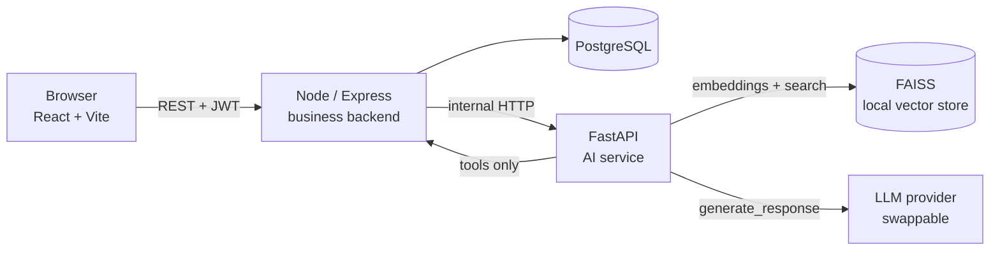
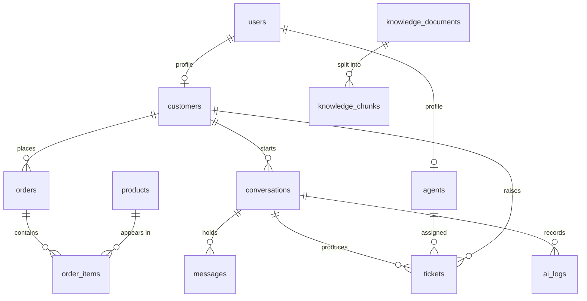

# AI Customer Support & Helpdesk Platform

A customer-support SaaS where an AI agent answers questions from your own policy
documents, calls real business tools for order and ticket data, and hands the
conversation to a human when it should not answer alone.

Runs entirely on a low-end Windows laptop. No GPU, no paid API required.

**Status: Phase 1 complete.** Accounts, roles, database and the three service
shells are working. Chat, RAG, tools and analytics land in later phases — see
[Roadmap](#roadmap).

---

## Architecture



Three deliberate boundaries:

**Business logic never lives in the AI service.** Express owns users, orders,
tickets and every SQL query. FastAPI owns retrieval, prompting and analysis.

**The model never touches the database.** When the AI needs order data it calls a tool,
the tool calls an Express endpoint, and Express queries the database. The blast
radius of a bad generation is a failed HTTP call, not a `DELETE`.

**One LLM seam.** Everything calls `generate_response()` on an `LLMProvider`.
Swapping providers is a `.env` change, not a refactor.

## Tech stack

| Layer | Choice | Why |
|---|---|---|
| Frontend | React 18, Vite, Tailwind, React Router, Axios | Fast dev server, no heavy UI kit |
| Backend | Node 18+, Express, Sequelize, PostgreSQL 16 | Familiar, boring, well-documented |
| Auth | JWT + bcrypt | Stateless, no session store to run |
| AI service | Python 3.11, FastAPI, Pydantic v2 | Type-checked contracts, free Swagger |
| Embeddings | `all-MiniLM-L6-v2`, local | ~90 MB, CPU-only, no API bill |
| Vector store | FAISS (local files) | No extra server; Qdrant swaps in later |

---

## Repository layout

```
ai-helpdesk/
├── backend/              Express: auth, users, tickets, orders, conversations
│   ├── src/
│   │   ├── config/       env loading, Sequelize instance, shared enums
│   │   ├── models/       12 Sequelize models + associations
│   │   ├── middleware/   auth, validation, rate limits, error handler
│   │   ├── services/     business logic (controllers stay thin)
│   │   ├── controllers/  request → service → response
│   │   ├── routes/       route definitions + zod schemas
│   │   ├── utils/        ApiError, response envelope, JWT, logger
│   │   └── seed/         sync.js, seed.js
│   └── tests/            supertest + jest
├── ai-service/           FastAPI: RAG, routing, tools, analysis
│   ├── app/
│   │   ├── api/          chat.py, health.py
│   │   ├── llm/          base.py, provider.py, echo_provider.py
│   │   ├── rag/          Phase 4–5
│   │   ├── agents/       Phase 6–7
│   │   ├── tools/        Phase 6
│   │   └── core/         config, logging, errors
│   ├── data/             documents/, vector_store/
│   └── main.py
├── frontend/             React app
│   └── src/  api/ components/ context/ layouts/ pages/ routes/ styles/
├── knowledge-base/       Seed documents the AI will be grounded in
└── docs/
```

---

## Setup

### Prerequisites

- Node.js 18 or newer
- Python 3.11
- PostgreSQL 16 running locally

### 1. PostgreSQL

Open **SQL Shell (psql)** from the Start menu (installed with PostgreSQL), press
Enter through the host/port/database/username prompts to accept the defaults,
then enter the password you set for the `postgres` user during install. Run:

```sql
CREATE DATABASE helpdesk;
CREATE DATABASE helpdesk_test;

CREATE USER helpdesk_user WITH PASSWORD 'a_password_you_choose';
GRANT ALL PRIVILEGES ON DATABASE helpdesk TO helpdesk_user;
GRANT ALL PRIVILEGES ON DATABASE helpdesk_test TO helpdesk_user;

-- PostgreSQL 15+ also needs explicit schema rights for a non-owner role:
\c helpdesk
GRANT ALL ON SCHEMA public TO helpdesk_user;
\c helpdesk_test
GRANT ALL ON SCHEMA public TO helpdesk_user;
```

### 2. Backend

```bat
cd backend
copy .env.example .env
npm install
```

Edit `.env`: set `DB_PASSWORD` and generate a real `JWT_SECRET`:

```bat
node -e "console.log(require('crypto').randomBytes(48).toString('hex'))"
```

Create the tables and load demo data:

```bat
npm run db:sync
npm run db:seed
npm run dev
```

### 3. AI service

```bat
cd ai-service
copy .env.example .env
python -m venv venv
venv\Scripts\activate
pip install -r requirements.txt
uvicorn main:app --reload --port 5001
```

`requirements.txt` includes `sentence-transformers` and `faiss-cpu` for Phase 5.
They pull a CPU build of torch (~200 MB). If that is slow on your connection,
comment those three lines out now and install them when Phase 5 starts — nothing
in Phase 1 imports them.

### 4. Frontend

```bat
cd frontend
copy .env.example .env
npm install
npm run dev
```

Three terminals, three ports: frontend 5173, backend 5000, AI service 5001.

---

## Demo accounts

Created by `npm run db:seed`. Local development only.

| Role | Email | Password |
|---|---|---|
| Admin | admin@helpdesk.local | Password123 |
| Agent | priya@helpdesk.local | Password123 |
| Customer | amara@example.com | Password123 |

---

## Verifying Phase 1 + 2 + 3 + 4

| Check | Expected |
|---|---|
| `curl http://localhost:5000/api/health` | `{"success":true,...,"database":"up"}` |
| `curl http://localhost:5001/health` | `llm_provider: "echo"`, `knowledge_base_chunks: 0` on a fresh setup |
| http://localhost:5001/docs | Swagger UI with `/chat`, `/health`, and `/ingest` |
| Sign in as the customer | Lands on `/chat` |
| Type a message and send it | A reply appears — the honest `[echo provider]` placeholder, since no real model is wired up until Phase 5 |
| Visit **Past chats** | The thread you just started is listed, with its status |
| From the thread, click **Ask for a human** | Status changes to "Waiting agent"; a matching ticket appears under **My tickets** |
| Sign in as the agent, open **Live chats → Waiting** | The same thread appears; click **Take over** |
| Reply as the agent | Message appears in the thread; sign back in as the customer to see it |
| As the customer, raise a ticket from **My tickets** | It appears immediately, status OPEN |
| As the agent, **Tickets → Queue**, claim it, add an internal note | Note shows on the agent/admin view, never on the customer's |
| As the agent, search **Customers** | Recent orders, tickets and conversations for that person appear |
| Sign in as the admin | Lands on `/admin/dashboard`; **People** lists 14 accounts |
| Admin → **Products**: create, edit, retire a product | Retired products drop out of the default list; still visible with "Show retired" checked |
| Admin → **Orders**: place a simulated order, update its tracking | Order total is computed from the items; tracking fields save independently of status |
| Admin → **Tickets**: reassign a ticket to a different agent | Assignment updates immediately |
| Admin → **Knowledge base**: upload one of the `knowledge-base/*.txt` files | Status moves to READY within a few seconds; chunk count is non-zero; clicking the document shows the actual chunk text |
| `curl http://localhost:5001/health` again | `knowledge_base_chunks` now matches the uploaded document's chunk count |
| Click **Re-index** on that document | Status returns to READY; chunk count unchanged (same source text) |
| Click **Delete** | Document disappears from the list; `knowledge_base_chunks` drops accordingly |
| Stop the AI service, then upload a document | Document reaches status FAILED with a readable error, not a crash |
| Customer visits `/admin/users` | Redirected to `/chat` |
| `cd backend && npm test` | 51 passing tests |
| `cd ai-service && pytest` | 35 passing tests |

---

## API (Phase 1)

All responses use one envelope: `{ success, message, data, meta? }` on success,
`{ success, message, details? }` on failure.

| Method | Endpoint | Auth | Purpose |
|---|---|---|---|
| GET | `/api/health` | — | Service and database status |
| POST | `/api/auth/register` | — | Create a customer account, returns a token |
| POST | `/api/auth/login` | — | Sign in, returns a token |
| POST | `/api/auth/logout` | any | Client drops the token |
| GET | `/api/auth/me` | any | Current user and role profile |
| PATCH | `/api/auth/password` | any | Change own password |
| GET | `/api/users` | admin | List users (`page`, `limit`, `role`, `search`) |
| POST | `/api/users` | admin | Create an agent, admin or customer |
| GET | `/api/users/:id` | admin | One user with profile |
| PATCH | `/api/users/:id` | admin | Update name or active flag |
| DELETE | `/api/users/:id` | admin | Deactivate (never a hard delete) |
| GET | `/api/conversations` | any | Own threads (customer) or the staff queue (agent/admin) |
| POST | `/api/conversations` | customer | Start a thread with its first message |
| GET | `/api/conversations/:id` | any | Full thread with messages (customer: own only) |
| POST | `/api/conversations/:id/messages` | any | Send a message (agent must have taken it over first) |
| POST | `/api/conversations/:id/handoff` | customer | Move the thread to the human queue |
| POST | `/api/conversations/:id/take-over` | agent, admin | Claim a queued conversation |
| PATCH | `/api/conversations/:id/status` | agent, admin | Change status (e.g. resolve, close) |
| GET | `/api/tickets` | any | Own tickets (customer) or the staff queue (agent/admin) |
| POST | `/api/tickets` | customer | Raise a ticket |
| GET | `/api/tickets/:id` | any | Ticket detail (internal notes never reach a customer) |
| PATCH | `/api/tickets/:id/status` | agent, admin | Change status |
| PATCH | `/api/tickets/:id/priority` | agent, admin | Change priority |
| PATCH | `/api/tickets/:id/assign` | agent, admin | Assign to an agent, or `null` to unassign |
| POST | `/api/tickets/:id/notes` | agent, admin | Add a staff-only internal note |
| GET | `/api/products` | any | Browse the catalog |
| GET/POST/PATCH/DELETE | `/api/products[/:id]` | admin (mutations) | Manage the catalog; delete retires rather than deletes |
| POST | `/api/products/:id/reactivate` | admin | Bring a retired product back |
| GET | `/api/orders` | any | Own orders (customer) or all orders, searchable (staff) |
| GET | `/api/orders/by-number/:orderNumber` | any | Look up by order number (matches how people refer to orders) |
| POST | `/api/orders` | admin | Simulate placing an order (no real checkout in this project) |
| PATCH | `/api/orders/:id` | admin | Update status, tracking, carrier, estimated delivery |
| GET | `/api/customers` | agent, admin | Search the customer directory |
| GET | `/api/customers/:id` | agent, admin | A customer's profile plus recent orders, tickets, conversations |
| GET | `/api/knowledge` | admin | List knowledge base documents |
| POST | `/api/knowledge` | admin | Upload a `.txt` document; ingests it synchronously |
| GET | `/api/knowledge/:id` | admin | Document detail with its stored chunks |
| POST | `/api/knowledge/:id/reindex` | admin | Clear and re-run ingestion for a document |
| DELETE | `/api/knowledge/:id` | admin | Remove a document, its chunks, and its vectors |

Status codes: 400 malformed, 401 missing or bad token, 403 wrong role or
deactivated, 404 unknown route or record, 409 duplicate email, 422 validation
failure with a `details` array, 429 rate limited, 500 unexpected.

AI service: `GET /health`, `POST /chat`, `POST /ingest`, `DELETE /ingest/{document_id}`.
Swagger at `/docs`. The ingestion endpoints are called by the Node backend
only — the browser never talks to the AI service directly.

---

## Database

12 tables, all with foreign keys, indexes and timestamps.



`users` holds credentials and role; `customers` and `agents` hold the
role-specific fields. One person, one login, whichever hat they wear.

Chunk rows live in the database alongside their FAISS vector id, so the index can be
rebuilt from the database at any time without re-reading the source files.

---

## Security

bcrypt hashing (10 rounds, configurable) · JWT with expiry · role checks on
every private route · zod validation on body, params and query · helmet ·
explicit CORS allowlist · 20 requests / 15 min on auth endpoints, 300 on the
rest · the error handler never leaks a stack trace outside development ·
`passwordHash` excluded from queries by a Sequelize default scope · login gives
the same message for an unknown email and a wrong password.

`.env` is gitignored; `.env.example` documents every variable. No secret ever
goes in a `VITE_` variable, because anything prefixed that way ships to the
browser.

---

## Testing

```bat
cd backend
npm test
```

Uses `helpdesk_test`, dropped and rebuilt on each run, so development data is
untouched. Covers registration, duplicate email, weak password, login success
and failure, `/me`, unauthenticated access, role rejection, deactivated
account, unknown routes, starting a conversation, access control between
customers, the handoff → take-over → reply → resolve flow, a resolved thread
refusing new messages, product creation and retirement, order visibility
rules, the ticket lifecycle including internal notes never reaching a
customer response, staff-only customer lookup, and knowledge-base upload,
listing, re-index, and delete — including what happens when the AI service
call succeeds versus fails, which is mocked deliberately so both outcomes get
tested rather than whichever one happens to occur.

No AI service needs to be running for the conversation tests: with nothing
listening on `AI_SERVICE_URL`, the AI call fails and the honest fallback
message is saved instead — the same behaviour a real outage would trigger.
The knowledge-base tests mock the AI service client directly instead, since
they need to assert on both a successful ingestion and a failed one, not just
whichever the environment happens to produce.

The AI service has its own pytest suite covering the RAG pipeline: loader
and splitter against the real policy documents in `knowledge-base/`, the
vector store's add/search/persist/remove-by-document behaviour, and the
`/ingest`, `/health` and error-response endpoints through FastAPI's
TestClient. The embedding model is mocked throughout (see
`tests/conftest.py`), so the suite runs in under a second and needs no model
download:

```bat
cd ai-service
venv\Scripts\activate
pip install -r requirements.txt
pytest
```

35 tests, all passing.

Deeper RAG-in-chat and tool-calling tests arrive with the behaviour they
test, in Phases 5–7.

---

## Roadmap

| Phase | Scope | State |
|---|---|---|
| 1 | Structure, auth, roles, PostgreSQL, service shells | Done |
| 2 | Conversations and messaging | Done |
| 3 | Tickets, orders, products | Done |
| 4 | Knowledge-base upload and ingestion | Done |
| 5 | RAG retrieval and grounded answers | Next |
| 6 | AI router and tool calling | |
| 7 | Human handoff | Basics done in Phase 2* |
| 8 | AI analytics and dashboards | |
| 9 | Hardening, migrations, fuller test suite | |
| 10 | Docker Compose and deployment | |

\* Requesting a human, an agent taking a conversation over, and replying as
that agent all work now. What's still ahead for Phase 7: automatic handoff
triggers (the AI deciding on its own that a conversation needs a person,
once Phase 6 gives it a reason to), and richer agent tooling like internal
notes, which arrive with tickets in Phase 3.

Placeholder screens in the app name the phase that fills them in, so nothing in
the UI pretends to work when it does not.

## Git

```bat
git init
git add .
git commit -m "feat: phase 1 - project structure, auth and role-based access"
git branch develop
```

Work on `feature/*` branches off `develop`, merge to `main` when a phase is
verified.
